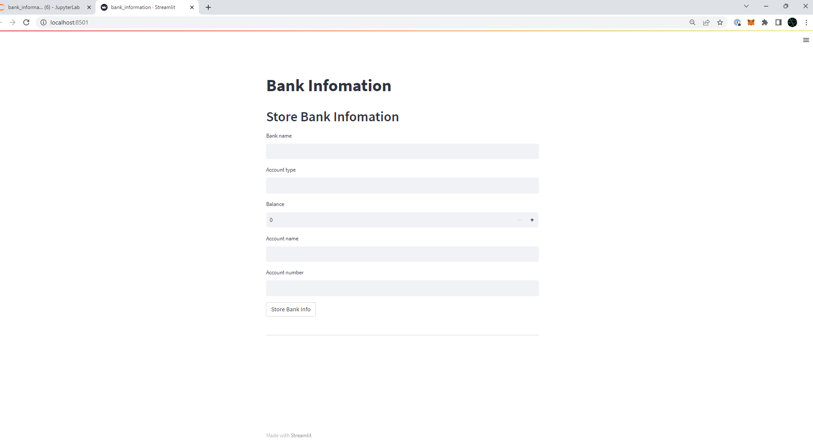

# digital-Wallet
**Digital-Wallet**
------
*A digital wallet that incorporates KYC (know-your-customer) requirements and securely stores banking information is essential for individuals in today's digital age. The importance of KYC cannot be overstated, as it ensures the safety and security of financial transactions, protects against fraud, and helps to prevent money laundering and other illicit activities. The convenience of a digital wallet that can store banking information securely is also significant, as it enables users to easily make and receive payments, transfer money, and manage their finances from the comfort of their own devices. With the added layer of KYC, users can rest assured that their transactions are protected and secure, making the digital wallet a must-have tool for anyone looking to manage their finances in a safe and efficient way.*

---
**What is KYC:**
--

KYC stands for "Know Your Customer". It is a process used by companies and organizations to verify the identity of their customers or clients.The KYC process involves collecting personal information from the customer, such as their name, address, and government-issued identification. This information is then verified by a third-party service provider, who checks it against various databases to ensure its accuracy. Once the KYC process is complete, the customer is granted access to the company's products or services. KYC is an important aspect of regulatory compliance, and failure to comply with KYC requirements can result in legal and financial penalties.

**What is Blockchain:**
--

Blockchain is a digital ledger technology that enables secure and transparent online transactions. It is a decentralized, distributed database that is maintained by a network of computers, rather than a central authority. Each block in the chain contains a record of several transactions, which are validated by network participants and added to the ledger. The information in each block is encrypted and connected to the previous block, creating a chronological chain of blocks that cannot be altered or deleted without consensus from the network.

**KYC in Blockchain:**
--

KYC in blockchain refers to the process of verifying the identity of a customer or user on a blockchain network. KYC is an important aspect of blockchain security and compliance, and it helps to build trust among users and investors in the network. This is done to prevent fraud, money laundering, and other criminal activities on the network.

Here are the steps to create a smart contract for KYC in blockchain:

(Source:
https://techblog.geekyants.com/decentralized-kyc-on-blockchain-a-case-study#heading-please-find-the-full-source-code-herehttpsgithubcomgeekyantssample-decentralised-kyc-ethereum)

  1. Define the KYC process: Define the steps involved in the KYC .process, such as collecting customer information, verifying the information, and storing it on the blockchain.
  2. Write the smart contract code: Use a programming language such as Solidity to write the smart contract code. The code should include functions for collecting customer information, verifying the information, and storing it on the blockchain.
 3. Define the data structure: Define the data structure for storing customer information on the blockchain. This can include fields such as name, address, date of birth, and identification number.Implement the verification process.blockchain.
4. Implement a verification process to ensure that the customer information is accurate and valid. This can include verifying the customer's identification documents and conducting background checks.
blockchain.
5. Deploy the smart contract: Deploy the smart contract on the blockchain network. Once deployed, the smart contract will automatically execute the KYC process when triggered by certain conditions.
6. Test the smart contract: Test the smart contract to ensure that it is functioning as intended and that customer information is being securely stored on the blockchain.

In blockchain, we have used smart contract for NFT - ERC-721 to automate the KYC process and ensure that customer information is securely stored on the blockchain. Below are the contracts cretaed which is then compiled and saved as backend source to facilitate the frontend app.
We have created the below contracts:
 - **Customer General Info Contract:** This includes creating, validating and storing basic information of the customer that includes name, age, gender, address etc.
 - **Customer Identification Contract:** This includes creating, validating and storing customer's identfication documents such as driving licence.
 - **Customer Health Information Contract:** This includes creating, validating and storing customer's health identfication documents such as vaccine reports.
 - **Customer Financial Information Contract:** This includes creating, validating and storing customer's financial documents such as banking information on debit/credit card, online tools such as PayPal etc.

*It's important to note that creating a smart contract for KYC requires a good understanding of blockchain technology and programming languages such as Solidity. It's also important to follow best practices for smart contract development to ensure that the contract is secure and free from vulnerabilities.

**Usage and Installation**

Tech Stack:
* Backend - Solidity, Python, Ganache and Metamask
* Frontend - React, Bootstrap
* Libraries - Web3, os, json, dotenv, streamlit, python scrip

**Installation Instructions**

Install:
* a local development server
* jupyter lab using  with latest python version
* libraries for .py script as required
* Ganache with quickstart
* Metamask (with imported accounts from Ganache)
* Use Solidity smart contracts on Remix platform

## Summary of Analysis

#### Register User IDs on Blockchain

Solidity smart contracts were developed with [OpenZepplin ERC721](https://docs.openzeppelin.com/contracts/2.x/api/token/erc721) interfaces, contracts, and utilities to generate token for ID information entered by the user.  For MVP (minimum viable product), three specific IDs were defined, each with its own solidity contract:

* Drivers Licence ID: [drivers.sol](https://github.com/akramTaki/digital-identity/blob/main/contracts/drivers.sol)
* Health Card ID: [health.sol](https://github.com/akramTaki/digital-identity/blob/main/contracts/health.sol)
* Passport ID: [passport.sol](https://github.com/akramTaki/digital-identity/blob/main/contracts/passport.sol)

Each contract contains two functions:
1. Provide initial ID information
2. Update the ID Number (as required)

The contracts also provide a receipt of initial information input as a way to indicate that the information has made to the block and has been tokenized. The user can also see a report of updates once the ID Number is updated.

##### Demo: Deploy and Test (Click for re-Direct to Youtube)

Once the [drivers.sol]() contract was compiled, it was deployed using Metamask gas transaction.  The deployed address was copied to the .env file for the test. The `ABI` file was copied to the `.json` file in the compiled folder for use by the `drivers_app.py` file (not shown in video). The [drivers_app.py]() file was opened in jupyter lab and tested using local terminal and streamlit for evaluation. 

#### Register both centralized and decentralized banking information on Blockchain

ERC-721 is a widely used standard for creating non-fungible tokens (NFTs) on the Ethereum blockchain. The importance of using ERC-721 to register both centralized and decentralized banking information lies in its ability to create unique and tamper-proof tokens that can represent ownership of assets, including digital assets such as banking information. By utilizing this standard, users can create NFTs that represent their banking information and store them securely on the blockchain. This provides an immutable record of ownership, making it difficult for unauthorized parties to access or manipulate the data. The decentralized nature of the Ethereum blockchain also ensures that this information cannot be controlled by any single entity, reducing the risk of data breaches and hacks. Overall, using ERC-721 to register banking information provides an additional layer of security and transparency, making it an essential tool for individuals and businesses looking to manage their financial data in a secure and decentralized manner.

[Video demostrating the use ERC-721 to store financial information](https://studio.youtube.com/video/VfaFHO8a-uw/edit)

The video demonstrates the use of ERC-721 standard for registering and securely storing banking information on the Ethereum blockchain. It shows how NFTs can be created to represent ownership of assets, including digital assets such as banking information, and how these NFTs can be stored and accessed on the blockchain. The video emphasizes the importance of using ERC-721 for securing banking information, as it provides a tamper-proof record of ownership, making it difficult for unauthorized parties to access or manipulate the data. By using this standard, users can ensure the safety and security of their financial data while also taking advantage of the decentralized nature of the Ethereum blockchain. Overall, the video serves as a valuable demonstration of how ERC-721 can be used to manage and secure banking information in a decentralized and transparent way.

#### Sources

* Decentralized KYC on Blockchain: https://techblog.geekyants.com/decentralized-kyc-on-blockchain-a-case-study#heading-please-find-the-full-source-code-herehttpsgithubcomgeekyantssample-decentralised-kyc-ethereum)
* Origin Identity Playground:  https://github.com/OriginProtocol/origin-playground; Video:  https://www.youtube.com/watch?v=jjUKWRK8H2g
* 
